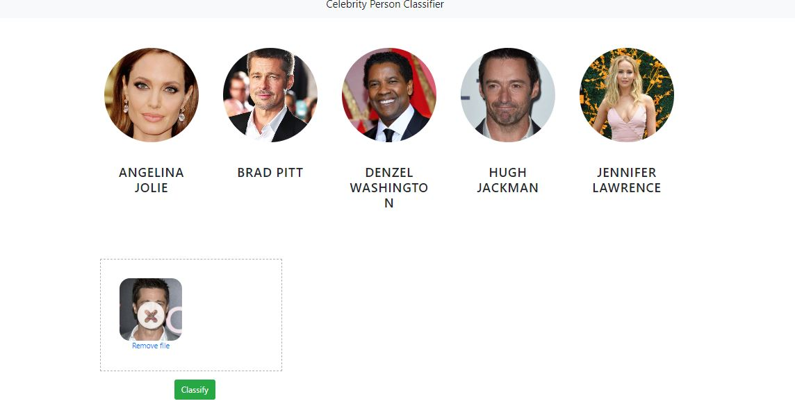

In the context of this data science and machine learning project, objective is to categorize celebrity individuals. Classification task is specifically focused on a set of 17 distinct personalities.,
1) Angelina Jolie

2) Brad Pitt

3) Denzel Washington

4) Hugh Jackman

5) Jennifer Lawrence

6) Johnny Depp

7) Kate Winslet

8) Leonardo DiCaprio

9) Megan Fox

10) Natalie Portman

11) Nicole Kidman

112) Robert Downey Jr

13) Sandra Bullock

14) Scarlett Johansson

15) Tom Cruise

16) Tom Hanks

17) Will Smith

Folder structure as follows,
* UI : This contains ui website code 
* server: Python flask server
* model: Contains python notebook for model building
* images_dataset: Dataset used for model training

Technologies used in the project,
1. Python
2. Numpy and OpenCV for data cleaning
3. Matplotlib & Seaborn for data visualization
4. Sklearn for model building
5. Jupyter notebook, visual studio code 
6. Python flask for http server
7. HTML/CSS/Javascript for UI

